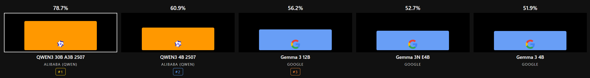
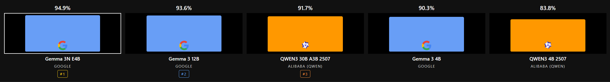
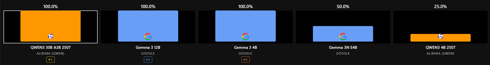
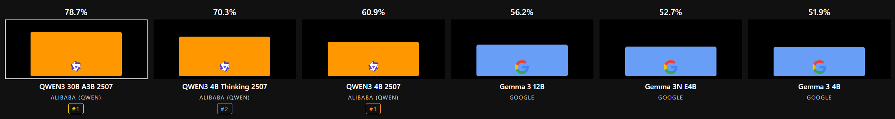
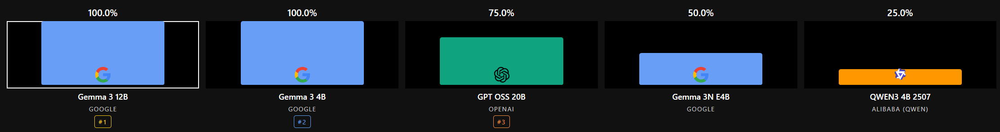
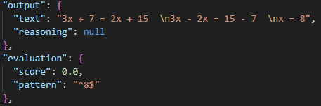
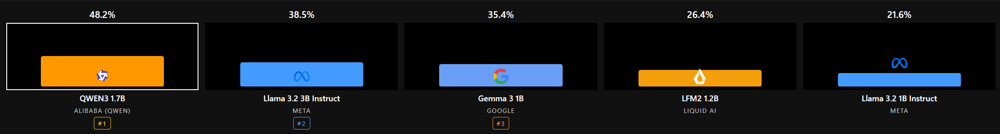
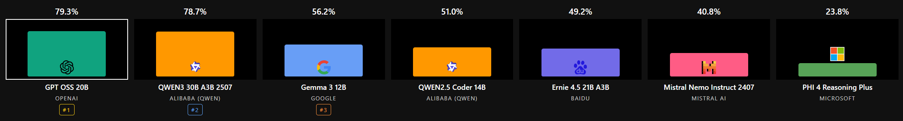
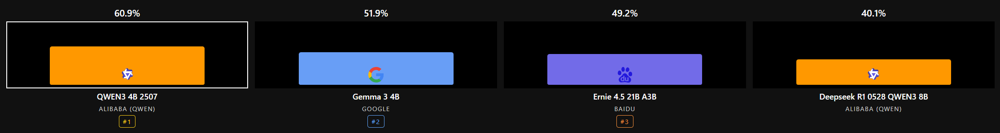

# TymBench

---
## Table of Contents
- [TymBench comparison website](#tymbench-comparison-website)
- [What is TymBench](#what-is-tymbench)
  - [Why was it created](#why-was-it-created)
  - [What is tested](#what-is-tested)
  - [Future](#future)
  - [Limitations](#limitations)
- [Tested models (16.09.2025)](#tested-models-16092025)
- [Findings (As of 16.09.2025)](#findings-as-of-16092025)
  - [Important](#important)
  - [Overall score](#overall-score)
    - [Qwen3 2507: The best small model of H2 2025?](#qwen3-2507-the-best-small-model-of-h2-2025)
      - [But what about thinking?](#but-what-about-thinking)
	  - [Gemma3: The math kings?](#gemma3-the-math-kings)
	  - [LLaMA 3 is an old architecture](#llama-3-is-an-old-architecture)
	  - [Bigger is better?](#bigger-is-better)
	- [Takeaways](#takeaways)

---

# [TymBench comparison website](https://tymektm.github.io/TymBench/)

## What is TymBench

TymBench is my personal benchmark for locally running Large Language Models (LLMs) and Small Language Models (SMLs). 

### Why was it created 
TymBench is direct response to lack of comparisons in SML category. I wanted to know whether Gemma 3 4B is better or worse than Qwen 3 4B (2507), but the internet lacked this information. This is my way of aggregating information about model raw performance (TTFT and tok/s are ignored in this benchmark). 

### What is tested
TymBench was created to test models capabilities in various areas such as:
- Coding
- Medicine
- Polish language understanding
- Polish grammar 
- Biology 
- General Culture
- General geography
- General History
- Math
- Physics 
- Polish literature 
- Reading comprehension 

These were selected by me as a good representation of important knowledge areas relevant for daily use.

### Future 
While creating TymBench I quickly realized that such a small sample set is not enough. I will keep updating this repo for a limited time, but I’ve already come to the conclusion that in the future TymBench V2 is inevitable. My goal for the next release would be bigger question set, including more languages and more even split between those. 

### Limitations
TymBench is intended for small language models, and big SOTA models will probably achieve 100% instantly - but that wasn’t the goal here.

--- 

# Tested models (16.09.2025)

- deepseek-r1-0528-qwen3-8b, 
- dolphin-2.8-mistral-7b-v02, 
- ernie-4.5-21b-a3b, 
- gemma-2-9b, 
- gemma-3-270m-it, 
- gemma-3-1b, 
- gemma-3-4b, 
- gemma-3-12b, 
- gemma-3n-e2b-it-text, 
- gemma-3n-e4b, 
- gpt-oss-20b, 
- granite-3.2-8b, l
- lfm2-350m, 
- fm2-1.2b, 
- llama-3.2-1b-instruct, 
- llama-3.2-3b-instruct, 
- mistral-nemo-instruct-2407 (12B), 
- nvidia_nvidia-nemotron-nano-9b-v2, 
- qwen2.5-coder-14b, 
- qwen3-1.7b, 
- qwen3-4b-2507, 
- qwen3-4b-thinking-2507, 
- qwen3-8b
- qwen3-30b-a3b-2507, 
- phi-4-mini-reasoning (3B),
- phi-4-reasoning-plus (15B)

---
# Findings (As of 16.09.2025)

Before I state my findings, I want to imply that everything written below is my subjective opinion. If you wish to see raw data, use the provided GitHub page with up-to-date interactive diagrams.

[Link to the page](https://tymektm.github.io/TymBench/)

Entire report is written by me (Human) by hand and revised by GPT-5 by OpenAI.

# Important

All models had explicitly stated that they should only return the answer. This is also a test for this simple instruction following. They may have answered correctly, but my regex may not have found an answer it was looking for. After all, this is my simple bench, not created to verify SOTA models, just those that caught my eye.

## Overall score

When we look at the chart we can quickly observe that the biggest models (gpt-oss 20B and Qwen3 30B A3B 2507) performed the best across all benchmarks. It is important to remind that Qwen3 was tested as a non-thinking variant, which shows the quality of this model. Being able to compete with gpt-oss (a thinking model!) is a great achievement for the Alibaba Qwen lab!
![[Pasted image 20250917132938.png]]
### Qwen3 2507: The best small model of H2 2025?

For a long time I was a giant fan of the Gemma3 (and 3n) model family. This changed when I downloaded Qwen3 4B 2507. This model seemed brilliant, and it was also the reason I decided to create TymBench, a way to measure model performance and quality by other means than "vibe."

When we look at the chart we can quickly observe one thing: Qwen3 4B 2507 excels at the overall score, only falling behind at "language (and medicine)" and Math (look at section: Important).

While those results can be fake in real-world performance, I think it is very interesting to see that a 4B model can outperform a 12B model.

#### But what about thinking?

When we give Qwen3 access to thinking, it will think - for a very, very, VERY long time.

Because I was running all of these models on my personal PC, I gave them all a context length of 16k tokens (16384 to be exact). Qwen3 4B Thinking 2507 used them all multiple times. It is possible that the score of it could be much higher (for example, in coding where it falls behind its non-thinking counterpart), but I had to give all models equal chances.

Qwen3 4B Thinking 2507 is, in my opinion, one giant over-thinker. In daily use, I would (and will!) use just the normal Qwen3 4B 2507. When reasoning is needed, I will probably settle for the (bigger and more token-efficient) gpt-oss 20B.

## Gemma3: The math kings?

When it came time to write this part, I verified scores of my favorite contenders Qwen3 4B 2507 and Gemma3 4B. Those are the same class of models, so naturally I wanted to see why Qwen was so far ahead in everything and falling behind in math. Well, to say the least, it hasn’t failed.

As I specified earlier, I wanted to test if models follow instructions as simple as "Zwróć tylko liczbę" (Pol. "Return only the number"). Qwen failed it. It "reasoned" its way through the problem. My regex looked at the answer and said: "Hmm, there isn’t an answer here, it’s just something that is wrong." It wasn’t wrong, it calculated the answer correctly, just at the end of its answer.

My regex was simple, in math problems it assumed that model may say something like: "Answer it 10" or just "10.". I was ready for it to obey my instruction just a bit, not write entire 7 + 3 = 10, my regex wasn't ready for it.

At the other end, Gemma2 9B, Gemma3 4B, and 12B answered correctly, exactly to my key I would dare to say. No reasoning, no calculations, just the correct token returned based on input.

Originally there was supposed to be one more math task, but I reclassified it to physics. In spirit, it is a math task. To say the least, all models have failed this task, not only small models, but gpt-oss 20B also.

After analyzing results of all models, I can gladly say that they can do math, just not follow instructions as well. This may be a result of training data, because a model that says how you can do it will deliver better results.

## LLaMA 3 is an old architecture

LLaMA 3.2 was what originally got me into local language models. Before, I thought GPT-3.5 Turbo was amazing and GPT-4 was AGI. When I was able to run this 1B model on my phone I was amazed. I still remember to this day the moment when I was on a plane, and my ears wouldn’t pop. I proudly opened Termux and launched Ollama with parameter llama-3.2-1B. After 5 minutes and about 8% of my battery, I received my answer - it helped. That was the moment I realized that SMLs are the future of AI.

But even after this heartbreaking story, I have to say, LLaMA 3 is an old architecture. When we look at the statistics - 22 and 39 percent score for LLaMA 3.2 1B and 3B respectively - we can notice it isn’t great. Comparing to Gemma3 1B at 35%, it is easy to say it’s not worth it to use small LLaMAs anymore.

# Bigger is better?

According to a definition I saw in an NVIDIA course, a Large Language Model is any model with more than 10B parameters. In my original testing set there are 7 LLMs. The best performing are of course GPT-OSS 20B and Qwen3 30B A3B 2507 - the largest models I have run up to this point. Until recently, I preferred the 4 - 7B range as the ideal size to run locally, since they fit comfortably into my GPU VRAM. That changed with the release of GPT-OSS.

At the top we find GPT-OSS 20B and Qwen3 30B A3B 2507 with equal scores. The former is stronger in “Language (and medicine)” and Polish literature, while the latter performs better in math (correct one-shot answers) and coding. I plan to test both in daily use in the future, but at this point they seem roughly equal. Qwen, however, is noticeably faster, which may be a decisive advantage.

The biggest disappointment in this category was Ernie 4.5 21B A3B. At this size, I expected it to perform only slightly worse than Qwen3 30B A3B 2507, but to my surprise it did even worse than Gemma 4B, a model roughly 81% smaller. Since it was hyped on X (Twitter), I included it in my benchmark, but based on these results I wouldn’t recommend it.

That was my conclusion until yesterday. I was actually writing this report while waiting for the final benchmark to finish, not expecting anything unusual. But when the results came in, I was stunned - it completely broke my assumptions. Honestly, it was a bit of a letdown moment. Phi-4-Reasoning-Plus, a 15B parameter model, was last on my list. I decided to start writing this report while it was running in the background. What can I say, after **six hours**, it scored 24%, on par with Gemma3… but the 270M parameter one. A model that is 98% smaller performed comparably in my benchmark.

Of course, I couldn’t just let something like this slip by, so I went and double-checked. Phi was the only model that repeatedly returned empty responses, and in other places it was simply wrong. That was the biggest shock for me. I had heard that Phi models weren’t great - but I wasn’t expecting _this_ bad. 

Mistral Nemo 2407 (12B) was added as a way to test Mistral’s models, but only after running all tests did I realize it had been released over 430 days earlier. That said, its performance still deserves a note: it ended up on par with LLaMA 3.2 3B, scoring 41% and 39% respectively.

# Takeaways
Creating the first version of TymBench was a very fun and educational journey. It showed me things that I couldn’t test in normal conversations with the models and gave me the ability to experiment with many of them quickly.

What I learned from my three days of running SMLs and LLMs for 18 hours a day is that technology and the quality of training data are everything. When models like Qwen3 4B 2507 can compete with models three or even ten times bigger in raw size, this becomes even clearer.

LLaMA models will definitely have a place in my “local models museum” as some of the most impactful in the space, but they are outdated and will no longer be part of my active LLM toolkit.

For my daily use case, I will stick with Qwen3 4B 2507 and continue experimenting with its bigger brother, Qwen3 30B A3B 2507. For more complex tasks, I will rely on GPT-OSS 20B.

Looking ahead, TymBench will need to evolve - both in test coverage and in methodology - but even now it shows how quickly the SML landscape is moving, and how much potential these models already have.

If TymBench has shown me anything, it’s that size alone no longer defines capability — training quality does.